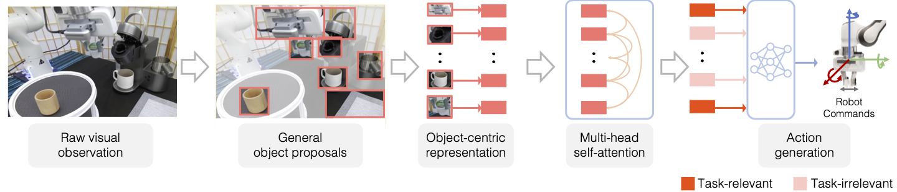

#  VIOLA: Imitation Learning for Vision-Based Manipulation with Object Proposal Priors

<p align="center">

</p>

[Yifeng Zhu](https://www.cs.utexas.edu/~yifengz), [Abhishek Joshi](), [Peter Stone](https://www.cs.utexas.edu/~pstone), [Yuke Zhu](https://www.cs.utexas.edu/~yukez/)


[Project](https://ut-austin-rpl.github.io/VIOLA) | [Paper](https://openreview.net/forum?id=L8hCfhPbFho) | [Simulation Datasets](https://utexas.box.com/shared/static/vn17v83v6h91poyqp0qqh9ozh7h2a6i4.zip) | [Real-Robot Datasets](https://utexas.box.com/shared/static/cetscq2l0vwxbj1l9m5zwuz5swq3kk8y.zip) | [Real Robot Control](https://ut-austin-rpl.github.io/deoxys-docs/html/getting_started/overview.html)

<!-- | [arxiv](http://arxiv.org/abs/2109.13841)  -->


## Introduction
We introduce VIOLA, an object-centric imitation learning approach
to learning closed-loop visuomotor policies for robot manipulation. Our approach
constructs object-centric representations based on general object proposals from a
pre-trained vision model. It uses a transformer-based policy to reason over these
representations and attends to the task-relevant visual factors for action prediction.
Such object-based structural priors improve deep imitation learning algorithm’s
robustness against object variations and environmental perturbations. We quanti-
tatively evaluate VIOLA in simulation and on real robots. VIOLA outperforms
the state-of-the-art imitation learning methods by 45.8% in success rates. It has
also been deployed successfully on a physical robot to solve challenging long-
horizon tasks, such as dining table arrangements and coffee making. More videos
and model details can be found in supplementary materials and the anonymous
	project website: [https://ut-austin-rpl.github.io/VIOLA](https://ut-austin-rpl.github.io/VIOLA).


### Real Robot Usage
This codebase does not include the real robot experiment setup. If you are interested in using the real robot control infra we use, please checkout [Deoxys](https://github.com/UT-Austin-RPL/deoxys_control)! It comes with a detailed [documentation](https://ut-austin-rpl.github.io/deoxys-docs/html/) for getting started.


## Installation
Git clone the repo by: 

``` shell
git clone --recurse-submodules git@github.com:UT-Austin-RPL/VIOLA.git
```

Then go into `VIOLA/third_party`, install each dependencies according
to their instructions: [detectron2](https://github.com/facebookresearch/detectron2), [Detic](https://github.com/zhuyifengzju/Detic)


Then install all the other dependencies. Most important packages are:
`torch`, `robosuite` and `robomimic`.
``` shell
pip install -r requirements.txt
```

## Usage

### Collect demonstrations and dataset creation

We by default assume the dataset is collected through spacemouse teleoperation.
``` shell
python data_generation/collect_demo.py --controller OSC_POSITION --num-demonstration 100 --environment stack-two-types --pos-sensitivity 1.5 --rot-sensitivity 1.5
```

Then create dataset from a data collection hdf5 file.

``` shell
python data_generation/create_dataset.py --use-actions
--use-camera-obs --dataset-name training_set --demo-file PATH_TO_DEMONSTRATION_DATA/demo.hdf5 --domain-name stack-two-types
```

### Augment datasets with color augmentations and object proposals

Add color augmentation to the original dataset:
``` shell
python data_generation/aug_post_processing.py --dataset-folder DATASET_FOLDER_NAME
```

Then we generate general object proposals using Detic models:
``` shell
python data_generation/process_data_w_proposals.py --nms 0.05
```

### Training and evaluation
To train a policy model with our generated dataset, run

``` 
python viola_bc/exp.py experiment=stack_viola ++hdf5_cache_mode="low_dim"
```

And for evaluation, run
``` 
python viola_bc/final_eval_script.py --state-dir checkpoints/stack --eval-horizon 1000 --hostname ./ --topk 20 --task-name normal
```

## Dataset and trained checkpoints

We also make the datasets we used in our paper publicly available. You
can download them:

**Datasets**:
Used datasets: [datasets](https://utexas.box.com/shared/static/vn17v83v6h91poyqp0qqh9ozh7h2a6i4.zip), and unzip it under the folder and rename
the folder's name to be `datasets`. Note that our simulation datasets are collected with robosuite v1.3.0, so the textures of robots, robots, and floors in datasets will not match robosuite v1.4.0.

**Checkpoints**:
Best checkpoint performance: [checkpoints](https://utexas.box.com/shared/static/fhr9lnsn8imodrirgu0sil3ey00m1m8p.zip)
unziip it under the root folder of the repo and rename it to be `results`.
